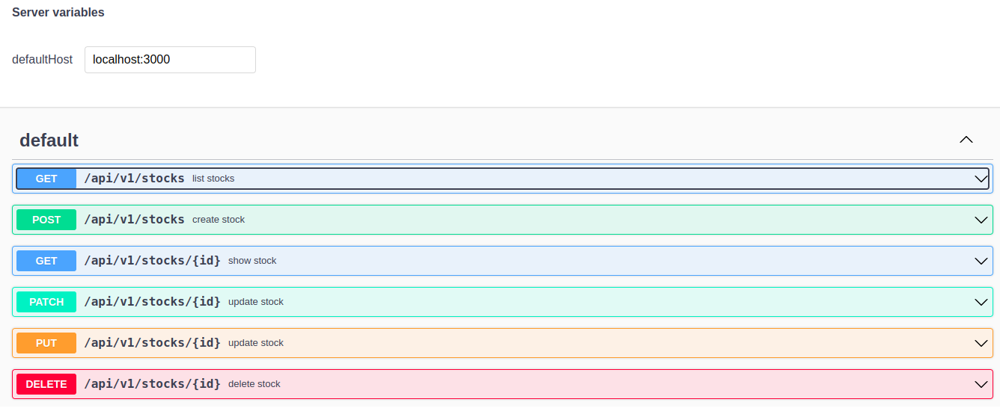
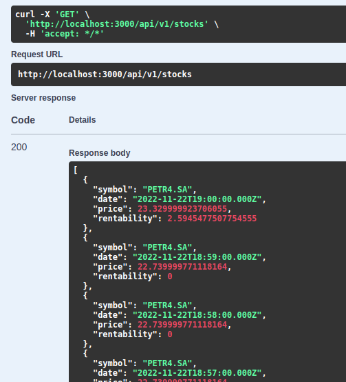
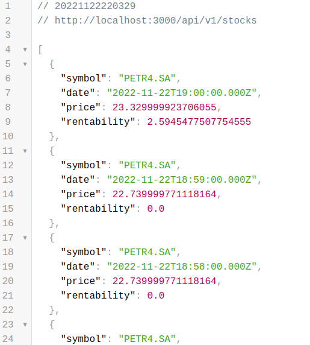

# Desafio Guide

Repositório com o intuito de realizar o desafio da Guide Investimentos: https://github.com/guideti/variacao-ativo

Fiz o projeto usando Docker, dessa forma é garantido que quem for rodar não terá problemas com versões, ou dependências.

### Passos para rodar local:

  - Clonar o repositório
  - docker-compose up

Pronto, só com isso ele já vai subir a aplicação na porta 3000.

### Testes

  Para rodar os testes:

  - bundle exec rspec

### Documentação

  Para ver a documentação da API:

 - http://localhost:3000/api-docs/index.html

Exemplo: 

### Resposta da API
Exemplo:

Conforme solicitado a api retorna os 30 primeiros pregões encontrados em https://query2.finance.yahoo.com/v8/finance/chart/PETR4.SA, fazendo a junção dos 2 vetores, timestamps e preços(open) pra calcular a rentabilidade a cada pregão.

